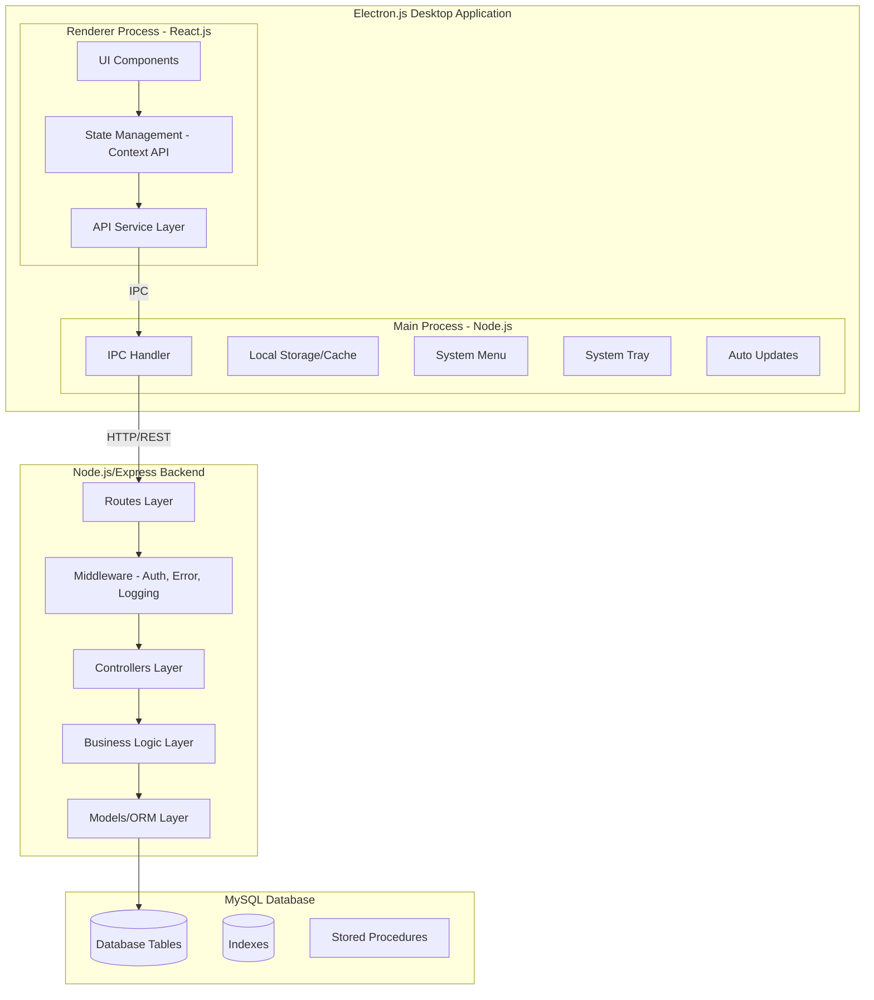
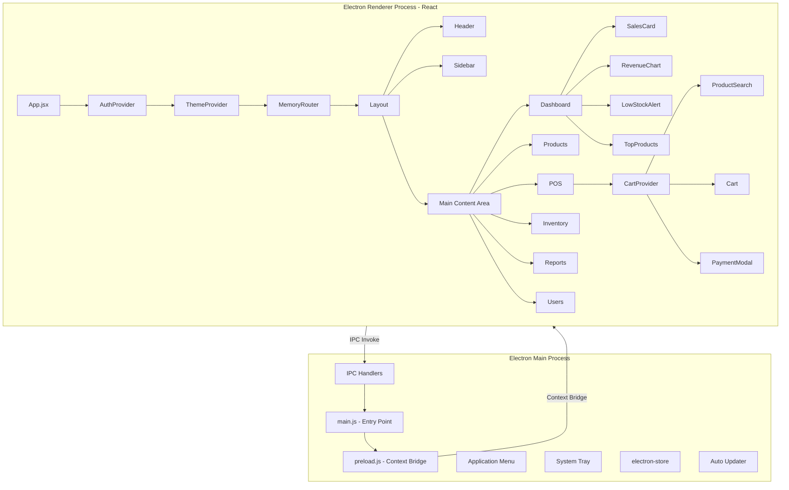
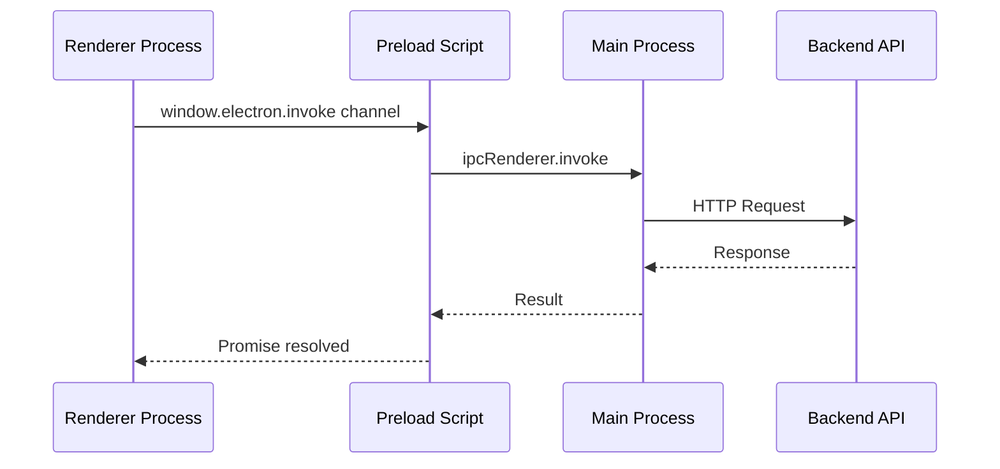
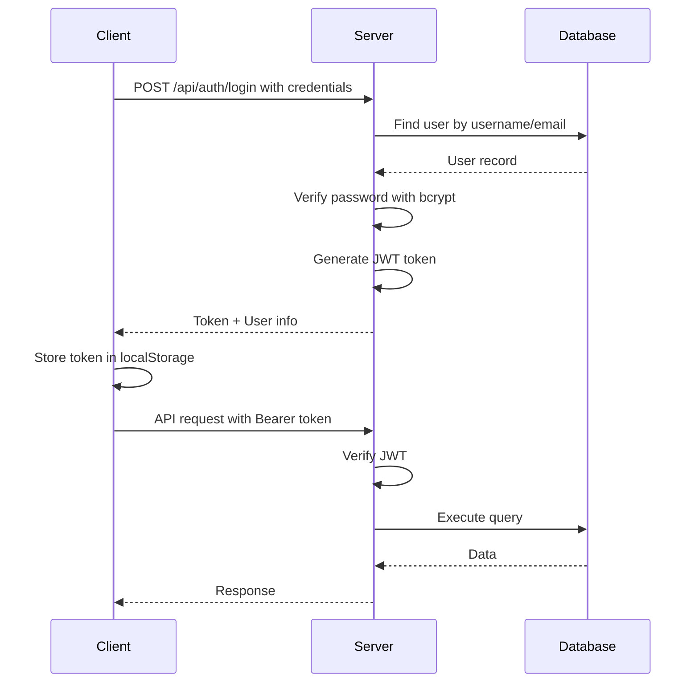

# Point of Sale (POS) System - Architecture Documentation

## Project Overview

A complete, production-ready Point of Sale system for a retail store with cash and card payment support, single location operation, and comprehensive inventory management. Built as a cross-platform desktop application using Electron.js.

---

## 1. System Architecture

### 1.1 High-Level Architecture Diagram



### 1.2 Technology Stack

| Layer | Technology | Purpose |
|-------|------------|---------|
| Desktop Framework | Electron.js 28+ | Cross-platform Desktop App |
| Frontend | React.js 18+ | UI Framework |
| UI Library | Tailwind CSS + Headless UI | Styling and Components |
| State Management | React Context + useReducer | Global State |
| HTTP Client | Axios | API Communication |
| Backend | Node.js + Express.js | REST API Server |
| Authentication | JWT + bcrypt | Security |
| Database | MySQL 8.0 | Data Persistence |
| PDF Generation | PDFKit | Invoice/Receipt Generation |
| Logging | Winston | Application Logging |
| Validation | Joi / express-validator | Input Validation |
| Electron Store | electron-store | Local Settings Persistence |
| Auto Update | electron-updater | Application Updates |

---

## 2. Project Folder Structure

```
POS/
├── backend/
│   ├── src/
│   │   ├── config/
│   │   │   ├── database.js          # Database connection config
│   │   │   ├── jwt.js               # JWT configuration
│   │   │   └── app.js               # App configuration
│   │   ├── controllers/
│   │   │   ├── authController.js    # Authentication endpoints
│   │   │   ├── userController.js    # User management
│   │   │   ├── productController.js # Product CRUD
│   │   │   ├── categoryController.js# Category management
│   │   │   ├── saleController.js    # Sales transactions
│   │   │   ├── inventoryController.js# Inventory management
│   │   │   ├── supplierController.js# Supplier management
│   │   │   ├── reportController.js  # Reports generation
│   │   │   └── dashboardController.js# Dashboard analytics
│   │   ├── middleware/
│   │   │   ├── auth.js              # JWT verification
│   │   │   ├── rbac.js              # Role-based access control
│   │   │   ├── errorHandler.js      # Global error handling
│   │   │   ├── validator.js         # Request validation
│   │   │   └── logger.js            # Request logging
│   │   ├── models/
│   │   │   ├── User.js              # User model
│   │   │   ├── Product.js           # Product model
│   │   │   ├── Category.js          # Category model
│   │   │   ├── Sale.js              # Sale model
│   │   │   ├── SaleItem.js          # Sale item model
│   │   │   ├── Inventory.js         # Inventory model
│   │   │   ├── Supplier.js          # Supplier model
│   │   │   ├── PurchaseOrder.js     # Purchase order model
│   │   │   └── InventoryLog.js      # Inventory history model
│   │   ├── routes/
│   │   │   ├── auth.routes.js       # Auth routes
│   │   │   ├── user.routes.js       # User routes
│   │   │   ├── product.routes.js    # Product routes
│   │   │   ├── category.routes.js   # Category routes
│   │   │   ├── sale.routes.js       # Sale routes
│   │   │   ├── inventory.routes.js  # Inventory routes
│   │   │   ├── supplier.routes.js   # Supplier routes
│   │   │   ├── report.routes.js     # Report routes
│   │   │   └── dashboard.routes.js  # Dashboard routes
│   │   ├── services/
│   │   │   ├── authService.js       # Auth business logic
│   │   │   ├── productService.js    # Product operations
│   │   │   ├── saleService.js       # Sale processing
│   │   │   ├── inventoryService.js  # Inventory operations
│   │   │   ├── reportService.js     # Report generation
│   │   │   └── pdfService.js        # PDF generation
│   │   ├── utils/
│   │   │   ├── response.js          # API response helpers
│   │   │   ├── logger.js            # Winston logger setup
│   │   │   ├── helpers.js           # Utility functions
│   │   │   └── constants.js         # App constants
│   │   └── app.js                   # Express app setup
│   ├── .env.example                 # Environment variables template
│   ├── .gitignore
│   ├── package.json
│   └── server.js                    # Server entry point
│
├── frontend/                        # Electron + React Application
│   ├── public/
│   │   ├── index.html
│   │   └── icons/                   # App icons for different platforms
│   ├── src/
│   │   ├── main/                    # Electron Main Process
│   │   │   ├── main.js              # Main entry point
│   │   │   ├── preload.js           # Preload script for IPC
│   │   │   ├── ipc/
│   │   │   │   ├── index.js         # IPC handlers registry
│   │   │   │   ├── appHandlers.js   # App-related IPC handlers
│   │   │   │   ├── printHandlers.js # Printing IPC handlers
│   │   │   │   └── fileHandlers.js  # File system IPC handlers
│   │   │   ├── menu/
│   │   │   │   └── menu.js          # Application menu
│   │   │   ├── utils/
│   │   │   │   ├── windowManager.js # Window management
│   │   │   │   ├── store.js         # electron-store setup
│   │   │   │   └── updater.js       # Auto-updater logic
│   │   │   └── tray/
│   │   │       └── tray.js          # System tray functionality
│   │   ├── renderer/                # React Renderer Process
│   │   │   ├── components/
│   │   │   │   ├── common/
│   │   │   │   │   ├── Button.jsx
│   │   │   │   │   ├── Input.jsx
│   │   │   │   │   ├── Modal.jsx
│   │   │   │   │   ├── Table.jsx
│   │   │   │   │   ├── Pagination.jsx
│   │   │   │   │   ├── SearchFilter.jsx
│   │   │   │   │   └── Loading.jsx
│   │   │   │   ├── layout/
│   │   │   │   │   ├── Header.jsx
│   │   │   │   │   ├── Sidebar.jsx
│   │   │   │   │   ├── Footer.jsx
│   │   │   │   │   └── Layout.jsx
│   │   │   │   ├── auth/
│   │   │   │   │   └── LoginForm.jsx
│   │   │   │   ├── dashboard/
│   │   │   │   │   ├── SalesCard.jsx
│   │   │   │   │   ├── RevenueChart.jsx
│   │   │   │   │   ├── LowStockAlert.jsx
│   │   │   │   │   └── TopProducts.jsx
│   │   │   │   ├── products/
│   │   │   │   │   ├── ProductList.jsx
│   │   │   │   │   ├── ProductForm.jsx
│   │   │   │   │   └── CategoryManager.jsx
│   │   │   │   ├── sales/
│   │   │   │   │   ├── POSInterface.jsx
│   │   │   │   │   ├── Cart.jsx
│   │   │   │   │   ├── ProductSearch.jsx
│   │   │   │   │   └── PaymentModal.jsx
│   │   │   │   ├── inventory/
│   │   │   │   │   ├── StockList.jsx
│   │   │   │   │   ├── StockAdjustment.jsx
│   │   │   │   │   ├── SupplierList.jsx
│   │   │   │   │   └── PurchaseOrderForm.jsx
│   │   │   │   └── reports/
│   │   │   │       ├── DailySalesReport.jsx
│   │   │   │       ├── MonthlySalesReport.jsx
│   │   │   │       └── ProductReport.jsx
│   │   │   ├── context/
│   │   │   │   ├── AuthContext.jsx  # Authentication state
│   │   │   │   ├── ThemeContext.jsx # Dark/Light mode
│   │   │   │   └── CartContext.jsx  # Shopping cart state
│   │   │   ├── hooks/
│   │   │   │   ├── useAuth.js
│   │   │   │   ├── useApi.js
│   │   │   │   ├── useIpc.js        # IPC communication hook
│   │   │   │   └── usePagination.js
│   │   │   ├── pages/
│   │   │   │   ├── Login.jsx
│   │   │   │   ├── Dashboard.jsx
│   │   │   │   ├── Products.jsx
│   │   │   │   ├── Categories.jsx
│   │   │   │   ├── POS.jsx
│   │   │   │   ├── Sales.jsx
│   │   │   │   ├── Inventory.jsx
│   │   │   │   ├── Suppliers.jsx
│   │   │   │   ├── Reports.jsx
│   │   │   │   └── Users.jsx
│   │   │   ├── services/
│   │   │   │   ├── api.js           # Axios instance
│   │   │   │   ├── authService.js
│   │   │   │   ├── productService.js
│   │   │   │   ├── saleService.js
│   │   │   │   ├── inventoryService.js
│   │   │   │   └── reportService.js
│   │   │   ├── utils/
│   │   │   │   ├── formatters.js    # Currency, date formatting
│   │   │   │   ├── validators.js    # Form validation
│   │   │   │   └── constants.js     # App constants
│   │   │   ├── App.jsx
│   │   │   ├── index.js
│   │   │   └── index.css            # Tailwind imports
│   │   └── shared/                  # Shared between main and renderer
│   │       ├── constants.js
│   │       └── ipcChannels.js       # IPC channel names
│   ├── .env.example
│   ├── package.json
│   ├── tailwind.config.js
│   ├── postcss.config.js
│   └── electron-builder.yml         # Electron build configuration
│
├── database/
│   ├── schema/
│   │   ├── 001_create_users.sql
│   │   ├── 002_create_categories.sql
│   │   ├── 003_create_products.sql
│   │   ├── 004_create_suppliers.sql
│   │   ├── 005_create_inventory.sql
│   │   ├── 006_create_sales.sql
│   │   ├── 007_create_sale_items.sql
│   │   ├── 008_create_purchase_orders.sql
│   │   ├── 009_create_inventory_logs.sql
│   │   └── 010_create_indexes.sql
│   ├── seeds/
│   │   └── seed_data.sql
│   └── er_diagram.md
│
├── docs/
│   ├── API_DOCUMENTATION.md
│   └── SETUP_GUIDE.md
│
└── README.md
```

---

## 3. Database Design

### 3.1 Entity-Relationship Diagram

```mermaid
erDiagram
    USERS ||--o{ SALES : creates
    USERS ||--o{ PURCHASE_ORDERS : manages
    USERS ||--o{ INVENTORY_LOGS : records
    
    CATEGORIES ||--o{ PRODUCTS : contains
    
    PRODUCTS ||--o{ SALE_ITEMS : included_in
    PRODUCTS ||--o{ INVENTORY : has
    PRODUCTS ||--o{ INVENTORY_LOGS : tracks
    
    SUPPLIERS ||--o{ PURCHASE_ORDERS : receives
    SUPPLIERS ||--o{ PRODUCTS : supplies
    
    SALES ||--o{ SALE_ITEMS : contains
    
    PURCHASE_ORDERS ||--o{ INVENTORY_LOGS : generates
    
    USERS {
        int id PK
        string username UK
        string email UK
        string password_hash
        string full_name
        string role
        boolean is_active
        datetime created_at
        datetime updated_at
    }
    
    CATEGORIES {
        int id PK
        string name UK
        string description
        int parent_id FK
        datetime created_at
        datetime updated_at
    }
    
    PRODUCTS {
        int id PK
        string name
        string barcode UK
        string sku UK
        int category_id FK
        decimal cost_price
        decimal selling_price
        int quantity_in_stock
        int reorder_level
        string unit
        text description
        string image_url
        boolean is_active
        datetime created_at
        datetime updated_at
    }
    
    SUPPLIERS {
        int id PK
        string name
        string contact_person
        string phone
        string email
        string address
        string tax_id
        boolean is_active
        datetime created_at
        datetime updated_at
    }
    
    INVENTORY {
        int id PK
        int product_id FK UK
        int quantity_available
        int quantity_reserved
        datetime last_updated
    }
    
    SALES {
        int id PK
        string invoice_number UK
        int user_id FK
        decimal subtotal
        decimal tax_amount
        decimal discount_amount
        decimal total_amount
        string payment_method
        decimal amount_paid
        decimal change_amount
        string status
        datetime sale_date
        datetime created_at
    }
    
    SALE_ITEMS {
        int id PK
        int sale_id FK
        int product_id FK
        string product_name
        decimal unit_price
        int quantity
        decimal subtotal
        decimal discount
        datetime created_at
    }
    
    PURCHASE_ORDERS {
        int id PK
        string po_number UK
        int supplier_id FK
        int user_id FK
        decimal total_amount
        string status
        date order_date
        date expected_date
        datetime created_at
        datetime updated_at
    }
    
    PURCHASE_ORDER_ITEMS {
        int id PK
        int purchase_order_id FK
        int product_id FK
        decimal unit_cost
        int quantity
        decimal subtotal
    }
    
    INVENTORY_LOGS {
        int id PK
        int product_id FK
        string transaction_type
        int quantity_change
        int quantity_after
        int reference_id
        string reference_type
        int user_id FK
        text notes
        datetime created_at
    }
```

### 3.2 Table Descriptions

| Table | Purpose |
|-------|---------|
| `users` | Store system users with roles (Admin, Cashier, Manager) |
| `categories` | Product categories with hierarchical support |
| `products` | Product catalog with pricing and stock info |
| `suppliers` | Supplier information for procurement |
| `inventory` | Real-time inventory tracking per product |
| `sales` | Sales transactions header |
| `sale_items` | Individual items in each sale |
| `purchase_orders` | Purchase orders to suppliers |
| `purchase_order_items` | Items in each purchase order |
| `inventory_logs` | Audit trail for all inventory changes |

---

## 4. API Endpoints Design

### 4.1 Authentication Endpoints

| Method | Endpoint | Description | Access |
|--------|----------|-------------|--------|
| POST | `/api/auth/login` | User login | Public |
| POST | `/api/auth/logout` | User logout | Authenticated |
| GET | `/api/auth/me` | Get current user | Authenticated |
| POST | `/api/auth/refresh` | Refresh token | Authenticated |

### 4.2 User Management Endpoints

| Method | Endpoint | Description | Access |
|--------|----------|-------------|--------|
| GET | `/api/users` | List all users | Admin |
| GET | `/api/users/:id` | Get user by ID | Admin |
| POST | `/api/users` | Create new user | Admin |
| PUT | `/api/users/:id` | Update user | Admin |
| DELETE | `/api/users/:id` | Delete user | Admin |

### 4.3 Product Endpoints

| Method | Endpoint | Description | Access |
|--------|----------|-------------|--------|
| GET | `/api/products` | List products with pagination | All |
| GET | `/api/products/:id` | Get product details | All |
| GET | `/api/products/barcode/:barcode` | Find by barcode | All |
| POST | `/api/products` | Create product | Admin, Manager |
| PUT | `/api/products/:id` | Update product | Admin, Manager |
| DELETE | `/api/products/:id` | Delete product | Admin |
| GET | `/api/products/low-stock` | Get low stock products | All |

### 4.4 Category Endpoints

| Method | Endpoint | Description | Access |
|--------|----------|-------------|--------|
| GET | `/api/categories` | List all categories | All |
| POST | `/api/categories` | Create category | Admin, Manager |
| PUT | `/api/categories/:id` | Update category | Admin, Manager |
| DELETE | `/api/categories/:id` | Delete category | Admin |

### 4.5 Sales Endpoints

| Method | Endpoint | Description | Access |
|--------|----------|-------------|--------|
| GET | `/api/sales` | List sales with filters | All |
| GET | `/api/sales/:id` | Get sale details | All |
| POST | `/api/sales` | Create new sale | All |
| GET | `/api/sales/:id/invoice` | Generate invoice PDF | All |
| GET | `/api/sales/receipt/:id` | Generate receipt | All |

### 4.6 Inventory Endpoints

| Method | Endpoint | Description | Access |
|--------|----------|-------------|--------|
| GET | `/api/inventory` | List inventory status | All |
| POST | `/api/inventory/adjust` | Adjust stock | Admin, Manager |
| GET | `/api/inventory/logs` | Inventory history | All |

### 4.7 Supplier Endpoints

| Method | Endpoint | Description | Access |
|--------|----------|-------------|--------|
| GET | `/api/suppliers` | List suppliers | All |
| POST | `/api/suppliers` | Create supplier | Admin, Manager |
| PUT | `/api/suppliers/:id` | Update supplier | Admin, Manager |
| DELETE | `/api/suppliers/:id` | Delete supplier | Admin |

### 4.8 Purchase Order Endpoints

| Method | Endpoint | Description | Access |
|--------|----------|-------------|--------|
| GET | `/api/purchase-orders` | List purchase orders | All |
| POST | `/api/purchase-orders` | Create PO | Admin, Manager |
| PUT | `/api/purchase-orders/:id` | Update PO | Admin, Manager |
| PUT | `/api/purchase-orders/:id/receive` | Receive PO items | Admin, Manager |

### 4.9 Report Endpoints

| Method | Endpoint | Description | Access |
|--------|----------|-------------|--------|
| GET | `/api/reports/daily-sales` | Daily sales report | Admin, Manager |
| GET | `/api/reports/monthly-sales` | Monthly sales report | Admin, Manager |
| GET | `/api/reports/product-performance` | Product performance | Admin, Manager |
| GET | `/api/reports/export/csv` | Export to CSV | Admin, Manager |
| GET | `/api/reports/export/pdf` | Export to PDF | Admin, Manager |

### 4.10 Dashboard Endpoints

| Method | Endpoint | Description | Access |
|--------|----------|-------------|--------|
| GET | `/api/dashboard/summary` | Dashboard summary stats | All |
| GET | `/api/dashboard/sales-chart` | Sales chart data | All |
| GET | `/api/dashboard/top-products` | Top selling products | All |
| GET | `/api/dashboard/low-stock` | Low stock alerts | All |

---

## 5. Role-Based Access Control (RBAC)

### 5.1 Permission Matrix

| Feature | Admin | Manager | Cashier |
|---------|-------|---------|---------|
| View Dashboard | ✓ | ✓ | ✓ |
| Create Sales | ✓ | ✓ | ✓ |
| View Products | ✓ | ✓ | ✓ |
| Create/Edit Products | ✓ | ✓ | ✗ |
| Delete Products | ✓ | ✗ | ✗ |
| View Inventory | ✓ | ✓ | ✓ |
| Adjust Inventory | ✓ | ✓ | ✗ |
| Manage Suppliers | ✓ | ✓ | ✗ |
| Create Purchase Orders | ✓ | ✓ | ✗ |
| View Reports | ✓ | ✓ | Limited |
| Export Reports | ✓ | ✓ | ✗ |
| Manage Users | ✓ | ✗ | ✗ |
| System Settings | ✓ | ✗ | ✗ |

---

## 6. Frontend Component Architecture

### 6.1 Electron Application Architecture



### 6.2 IPC Communication Pattern



### 6.3 State Management Flow

```mermaid
flowchart TB
    subgraph Global State
        Auth[AuthContext - User, Token, Permissions]
        Theme[ThemeContext - Dark/Light Mode]
    end
    
    subgraph Local State
        Cart[CartContext - Items, Total, Tax]
        Form[Form State - Validation, Errors]
        UI[UI State - Modals, Loading]
    end
    
    subgraph Electron State
        Settings[App Settings - electron-store]
        Window[Window State]
    end
    
    subgraph Server State
        Products[Products Data]
        Sales[Sales Data]
        Inventory[Inventory Data]
    end
    
    Auth --> API[API Calls via IPC]
    Cart --> API
    API --> Server State
    Server State --> UI Updates
    Settings --> Theme
```

### 6.4 Electron-Specific Features

| Feature | Implementation | Purpose |
|---------|---------------|---------|
| Window Management | BrowserWindow API | Multi-window support, kiosk mode |
| Local Storage | electron-store | Offline settings, cache |
| System Menu | Menu API | Native application menu |
| System Tray | Tray API | Background operation |
| Auto Update | electron-updater | Application updates |
| Notifications | Notification API | Native OS notifications |
| Print | webContents.print | Receipt/invoice printing |
| PDF Export | webContents.printToPDF | Generate PDF files |
| Barcode Scanner | Keyboard events | USB barcode scanner support |

---

## 7. Security Implementation

### 7.1 Authentication Flow



### 7.2 Security Measures

1. **Password Security**
   - bcrypt hashing with salt rounds of 12
   - Minimum password complexity requirements
   - Password reset functionality

2. **JWT Implementation**
   - Access token: 15 minutes expiry
   - Refresh token: 7 days expiry
   - Token stored in httpOnly cookies (optional)

3. **API Security**
   - Rate limiting (100 requests per 15 minutes)
   - Input validation with Joi
   - SQL injection prevention with parameterized queries
   - XSS protection with helmet.js
   - CORS configuration

4. **Role-Based Access**
   - Middleware checks user role before controller
   - Resource-level permissions
   - Audit logging for sensitive operations

---

## 8. Error Handling Strategy

### 8.1 Error Types

| Code | Type | HTTP Status |
|------|------|-------------|
| 400 | Validation Error | 400 |
| 401 | Authentication Error | 401 |
| 403 | Authorization Error | 403 |
| 404 | Not Found | 404 |
| 409 | Conflict Error | 409 |
| 500 | Server Error | 500 |

### 8.2 Error Response Format

```json
{
  "success": false,
  "error": {
    "code": "VALIDATION_ERROR",
    "message": "Invalid input data",
    "details": [
      {
        "field": "email",
        "message": "Invalid email format"
      }
    ]
  },
  "timestamp": "2024-01-15T10:30:00Z",
  "requestId": "req_abc123"
}
```

---

## 9. Logging System

### 9.1 Log Levels

- **ERROR**: Application errors, exceptions
- **WARN**: Warning conditions, deprecated usage
- **INFO**: General information, API requests
- **DEBUG**: Detailed debug information

### 9.2 Log Format

```json
{
  "timestamp": "2024-01-15T10:30:00Z",
  "level": "info",
  "message": "API Request",
  "method": "POST",
  "url": "/api/sales",
  "userId": 1,
  "duration": "45ms",
  "statusCode": 201
}
```

---

## 10. Scalability Considerations

### 10.1 Future AI Integration Points

1. **Sales Prediction API**
   - Endpoint: `/api/ai/predict-sales`
   - Input: Historical sales data
   - Output: Predicted sales for next period

2. **Demand Forecasting**
   - Endpoint: `/api/ai/forecast-demand`
   - Input: Product ID, date range
   - Output: Expected demand quantities

3. **Anomaly Detection**
   - Endpoint: `/api/ai/detect-anomalies`
   - Input: Transaction data
   - Output: Flagged suspicious activities

### 10.2 Performance Optimizations

1. **Database Indexing**
   - Index on `products.barcode`
   - Index on `sales.sale_date`
   - Composite index on `sale_items(sale_id, product_id)`

2. **Caching Strategy**
   - Redis for session storage
   - Cache frequently accessed products
   - Cache dashboard statistics

3. **API Optimization**
   - Pagination for all list endpoints
   - Field selection in GET requests
   - Response compression

---

## 11. Implementation Phases

### Phase 1: Foundation
- Project setup
- Database schema creation
- Authentication system
- Basic user management

### Phase 2: Core Features
- Product management
- Category management
- Basic inventory tracking

### Phase 3: Sales Module
- POS interface
- Cart functionality
- Payment processing
- Invoice generation

### Phase 4: Advanced Features
- Complete inventory management
- Supplier management
- Purchase orders
- Reports and analytics

### Phase 5: Polish & Deploy
- UI refinements
- Dark/light mode
- Error handling
- Documentation
- Deployment configuration

---

## 12. Environment Variables

### Backend (.env)
```
NODE_ENV=development
PORT=5000

# Database
DB_HOST=localhost
DB_PORT=3306
DB_NAME=pos_system
DB_USER=root
DB_PASSWORD=your_password

# JWT
JWT_SECRET=your_super_secret_key
JWT_EXPIRES_IN=15m
JWT_REFRESH_EXPIRES_IN=7d

# App
APP_NAME=POS System
APP_URL=http://localhost:5000
```

### Frontend/Electron (.env)
```
REACT_APP_API_URL=http://localhost:5000/api
REACT_APP_APP_NAME=POS System
RENDERER_REMOTE_API_URL=http://localhost:5000/api
```

### Electron Builder Configuration (electron-builder.yml)
```yaml
appId: com.pos-system.app
productName: POS System
directories:
  output: dist
  buildResources: build
files:
  - "**/*"
  - "!**/*.map"
extraResources:
  - from: "public/icons"
    to: "icons"
win:
  target:
    - nsis
    - portable
  icon: "public/icons/icon.ico"
mac:
  target:
    - dmg
    - zip
  icon: "public/icons/icon.icns"
linux:
  target:
    - AppImage
    - deb
  icon: "public/icons/icon.png"
nsis:
  oneClick: false
  allowToChangeInstallationDirectory: true
  createDesktopShortcut: true
publish:
  provider: github
  owner: your-github-username
  repo: pos-system
```

---

## Next Steps

1. Review and approve this architecture document
2. Create database schema SQL scripts
3. Set up backend project structure
4. Implement authentication system
5. Build out features incrementally

---

*Document Version: 1.0*
*Last Updated: February 2026*
